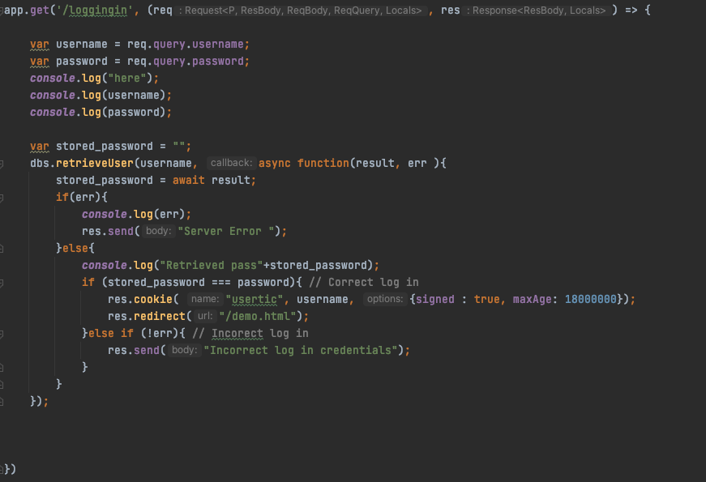
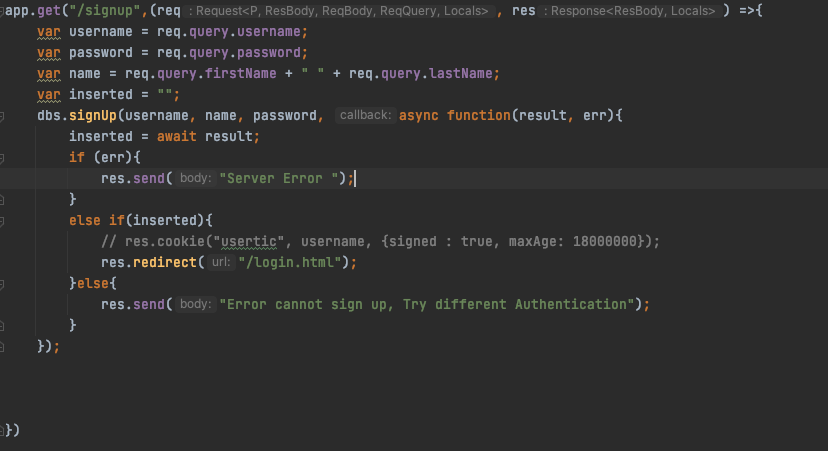
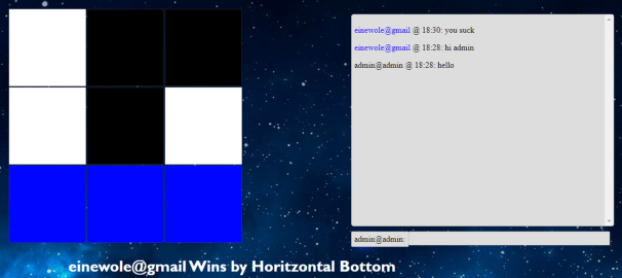

# Final Project Report

Author: Cole Hanniwell, Einstein Oyewole, Nick Dyer

Date: April 5th 2021

## Feature1 Login and Registration to use application
### F1.1 Login Page

{width=95%}

{width=95%}

{width=95%}

### F1.2 Sign up page

{width=95%}

{width=95%}

## Feature2 Bot to play against
### F2.1

{width=95%}

### F2.2

{width=95%}

{width=95%}

## Feature3. 2-player web socket
### F1.1 Room ID

{width=95%}

{width=95%}

{width=95%}

{width=95%}

{width=95%}

{width=95%}

{width=95%}

**Link**

- [WEb app](ec2-99-79-114-0.ca-central-1.compute.amazonaws.com)

## References

- HBF, CP476 Chat Server Example (Assignment 5)
- Russell, Stuart J. (Stuart Jonathan). Artificial Intelligence : a Modern Approach. Upper Saddle River, N.J. :Prentice Hall, 2010.
